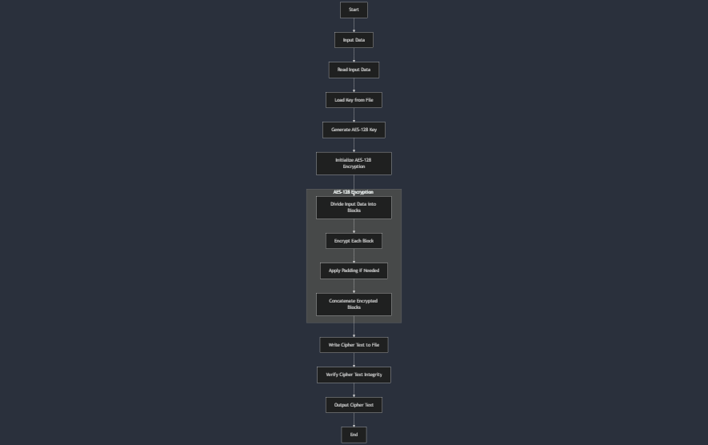
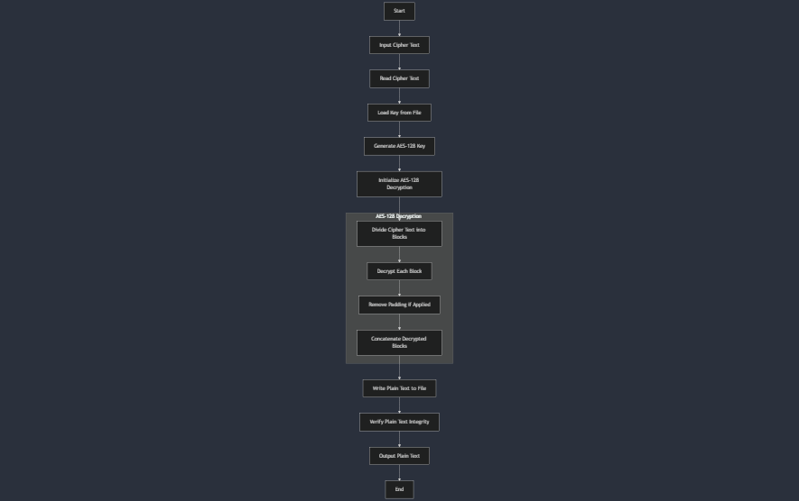
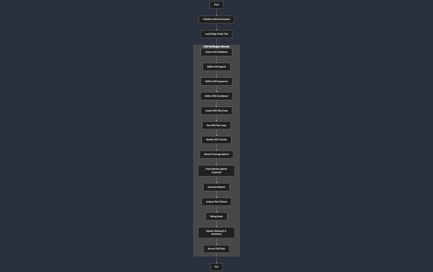

<link rel="stylesheet" type="text/css" href="style.css">

<!-- 
Author: Pirate-Emperor
Date: [Insert Date]
Description: README file for CipherX project.
-->

# CipherX


## Project Overview

CipherX is a project aimed at verifying the Advanced Encryption Standard (AES-128) using the Universal Verification Methodology (UVM). It involves using UVM components to ensure the correctness and robustness of AES-128 encryption and decryption functionalities. The project utilizes Verilog, SystemVerilog, and Python to achieve its goals.

## Project Directory Structure

Here's an overview of the project directory structure and the purpose of each file and folder:

### Root Directory

- **`src/`**: Contains source files and utilities.
  - **`cipher_text.txt`**: Stores cipher text data.
  - **`data.txt`**: Contains data for encryption and decryption.
  - **`encrypt.py`**: Python script for encryption tasks.
  - **`gen_random.py`**: Python script for generating random data.
  - **`key.txt`**: Contains encryption keys.
  - **`run.sh`**: Shell script to run the encryption and verification processes.

- **`uvm/`**: Contains UVM components and SystemVerilog files for AES-128 verification.
  - **`AES_act_agent.svh`**: Reference model and components.
  - **`AES_driver.svh`**: RTL and UVM driver components.
  - **`AES_env.svh`**: UVM environment components.
  - **`AES_if.svh`**: Interface components for UVM.
  - **`AES_monitor.svh`**: UVM monitor components.
  - **`AES_package.sv`**: UVM package containing necessary definitions.
  - **`AES_pas_agent.svh`**: Additional reference model components.
  - **`AES_scoreboard.svh`**: UVM scoreboard for result verification.
  - **`AES_sequence.svh`**: UVM sequence components.
  - **`AES_sequence_item.svh`**: UVM sequence item definitions.
  - **`AES_sequencer.svh`**: UVM sequencer components.
  - **`AES_subscriber.svh`**: UVM subscriber components.
  - **`AES_test.svh`**: UVM testbench components.
  - **`top.sv`**: Top-level SystemVerilog module.

## Technology Stack

- **Verilog**: 67.1%
- **C**: 17.8%
- **SystemVerilog**: 12.4%
- **Python**: 2.6%
- **Shell**: 0.1%

## Flow Charts

### 1. AES-128 Encryption Flow


### 2. AES-128 Decryption Flow


### 3. UVM Verification Flow


## SDLC

The Software Development Life Cycle (SDLC) for CipherX includes:

1. **Requirements Analysis**: Understanding and documenting the requirements for AES-128 verification.
2. **Design**: Creating system architecture, flowcharts, and detailed design documents for the UVM components and AES-128 verification.
3. **Implementation**: Coding the UVM components and verification scripts using Verilog, SystemVerilog, and Python.
4. **Testing**: Conducting simulation and verification tests to ensure the AES-128 implementation meets the required standards.
5. **Deployment**: Integrating the verification components into a testing environment.
6. **Maintenance**: Monitoring and updating the verification components based on feedback and new requirements.

## Highlight Testing Scripts

Testing is crucial for ensuring the correctness of the AES-128 implementation:

- **`encrypt.py`**: Encrypts data using AES-128.
- **`gen_random.py`**: Generates random data for encryption tests.
- **`run.sh`**: Executes the verification process including running simulations and tests.

## Skills Used

- **Verilog**: For hardware description and verification.
- **SystemVerilog**: For UVM-based verification components.
- **Python**: For utility scripts and data handling.
- **Shell**: For scripting and automation.

## Steps to Run

Follow these steps to set up and run the CipherX project:

### 1. Clone the Repository

Clone the repository using Git:

```bash
git clone https://github.com/Pirate-Emperor/CipherX.git
```

### 2. Set Up Environment

Ensure that you have the necessary tools installed:

- **Verilog/SystemVerilog Simulator**: For running UVM simulations.
- **Python**: For running the utility scripts.

### 3. Run Encryption and Verification

Execute the shell script to start the encryption and verification process:

```bash
./run.sh
```

### 4. Check the Results

Review the generated results and logs to verify the correctness of the AES-128 implementation.

## Contributing

Feel free to fork the repository, make changes, and submit pull requests. Contributions are welcome!

## License

This project is licensed under the Pirate-Emperor License. See the [LICENSE](LICENSE) file for details.

## Author

**Pirate-Emperor**

[](https://twitter.com/PirateKingRahul)
[](https://discord.com/users/1200728704981143634)
[](https://www.linkedin.com/in/piratekingrahul)

[](https://www.reddit.com/u/PirateKingRahul)
[](https://medium.com/@piratekingrahul)

- GitHub: [Pirate-Emperor](https://github.com/Pirate-Emperor)
- Reddit: [PirateKingRahul](https://www.reddit.com/u/PirateKingRahul/)
- Twitter: [PirateKingRahul](https://twitter.com/PirateKingRahul)
- Discord: [PirateKingRahul](https://discord.com/users/1200728704981143634)
- LinkedIn: [PirateKingRahul](https://www.linkedin.com/in/piratekingrahul)
- Skype: [Join Skype](https://join.skype.com/invite/yfjOJG3wv9Ki)
- Medium: [PirateKingRahul](https://medium.com/@piratekingrahul)

Thank you for visiting the CipherX project!

---

For more details, please refer to the [GitHub repository](https://github.com/Pirate-Emperor/CipherX).